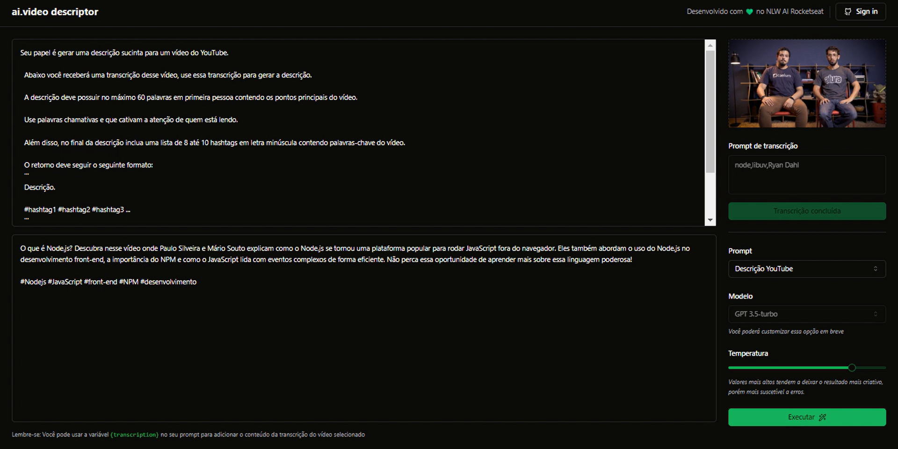

<div align="center">
  <h1 style="font-size: 40px"> ai.video</h1>
</div>

 Uma aplicação  que permite aos usuários realizar diversas ações a partir de um vídeo de entrada. Utilizando um conjunto de tecnologias modernas, ela oferece funcionalidades avançadas para melhorar a eficiência na criação de conteúdo para o YouTube.




[](https://vitejs.dev/)
[](https://tailwindcss.com/)
[](https://axios-http.com/)


## Principais recursos

- **Conversão de Vídeo para áudio**: A aplicação recebe um vídeo como entrada e utiliza o ffmpeg.wasm, uma versão em WebAssembly do popular FFmpeg, para realizar a conversão desse vídeo em um arquivo de áudio. Isso permite que os usuários trabalhem com o conteúdo de áudio de seus vídeos.

- **Integração com Chat GPT**: Após a conversão do vídeo em áudio, a aplicação envia o arquivo de áudio para um servidor que integra o Chat GPT (um modelo de linguagem avançado desenvolvido pela OpenAI). O Chat GPT é utilizado para realizar a transcrição do áudio, transformando-o em texto escrito de forma precisa e eficiente.

- **Geração de Ideias para YouTube**: Uma vez transcrita a conversa, a aplicação oferece a funcionalidade de enviar prompts ao Chat GPT com o objetivo de gerar ideias de títulos ou descrições de vídeos. Essas ideias são otimizadas para uma melhor indexação no YouTube, o que pode ajudar os criadores de conteúdo a alcançar um público mais amplo.

Pré-requisitos
--------------

Antes de prosseguir, certifique-se de que você tenha instalado o [Node.js](https://nodejs.org/) em sua máquina. O Node.js >=18 é necessário para executar a aplicação e suas dependências.

Passos para execução:
--------------------

1.  Clone o repositório da aplicação para o seu sistema local:

``` 
git clone https://github.com/deivisonresende/ai-video-descriptor-api.git
```

2.  Navegue até o diretório da aplicação:
 ```
 cd ai-video-descriptor-web
 ```

3.  Instale as dependências:

```
pnpm i
```

4. Execute a aplicação com o comando:
```
pnpm run dev
```

<br>

Projeto <code>ai.video</code> construído durante o evento NLW AI promovido pela [Rocketseat](https://www.rocketseat.com.br/) ministrado pelo [diego3g](https://github.com/diego3g)

